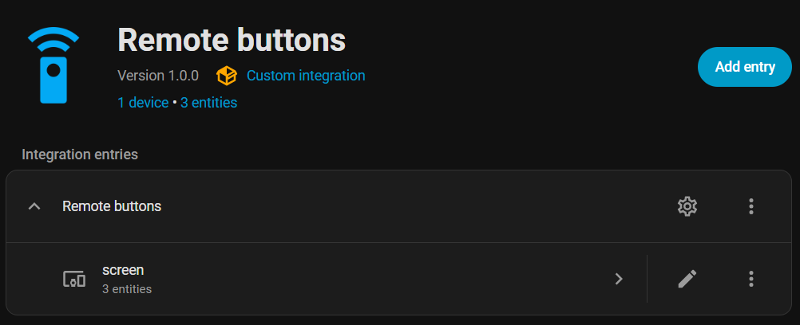
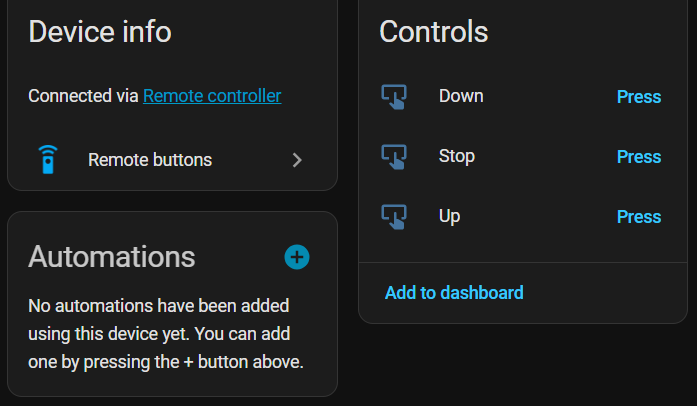
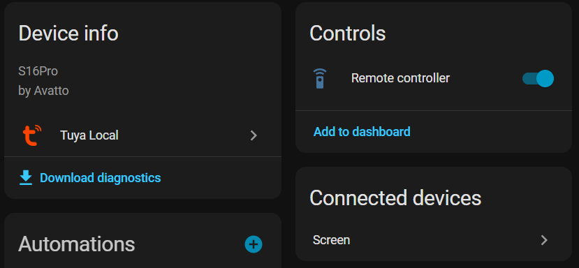

# Remote Buttons

[](https://github.com/hacs/integration)
[](https://github.com/kongo09/remote_buttons/actions/workflows/hacs.yml)
[](https://github.com/kongo09/remote_buttons/actions/workflows/hassfest.yml)
[](https://github.com/kongo09/remote_buttons/actions/workflows/ci.yml)
[](https://github.com/kongo09/remote_buttons/actions/workflows/tests.yml)
[](https://github.com/kongo09/remote_buttons/releases)

A Home Assistant custom integration that automatically creates **button entities** for every learnt command on your IR/RF remote entities.

Works with any remote integration that stores learnt commands using HA's `helpers.storage.Store` convention, especially:

- **[Broadlink](https://www.home-assistant.io/integrations/broadlink/)** remotes
- **[Tuya Local](https://github.com/make-all/tuya-local)** remotes

## Screenshots







## Coffee

<a href="https://www.buymeacoffee.com/kongo09" target="_blank"></a>

## How it works

1. You configure which remote entities to watch.
2. The integration reads each remote's stored commands and creates a button entity per command.
3. When you press a button, it calls `remote.send_command` on the underlying remote — no direct hardware interaction.
4. When you learn or delete commands, the integration detects the change and updates buttons automatically.
5. For IR sub-devices, two configuration entities are created — **IR delay** (seconds between commands) and **IR repeat** (number of repeats) — so you can tune send behaviour per device.
6. When a compatible remote integration is added, a repair issue notifies you so you can add it to the watch list.

## Installation

### HACS (recommended)

1. If you haven't already, install [HACS](https://hacs.xyz/).
2. [](https://my.home-assistant.io/redirect/hacs_repository/?owner=kongo09&repository=remote_buttons&category=integration)
3. Install **Remote Buttons** from the HACS integration list.
4. Restart Home Assistant.

### Manual

1. Download the [latest release](https://github.com/kongo09/remote_buttons/releases).
2. Extract and copy `custom_components/remote_buttons/` into your `config/custom_components/` directory.
3. Restart Home Assistant.

## Configuration

### Initial setup

1. [](https://my.home-assistant.io/redirect/config_flow_start/?domain=remote_buttons)
2. Select the remote entities you want to watch — only remotes that support `learn_command` are shown.
3. Button entities are created automatically for all learnt commands on the selected remotes.

#### Setup parameters

| Parameter | Description |
|---|---|
| **Remote entities** | One or more remote entities to watch. Only remotes on supported platforms (Broadlink, Tuya Local) that advertise the `learn_command` feature are listed. |

### Options

You can update the selection at any time via **Settings > Devices & Services > Remote Buttons > Configure**.

| Parameter | Description |
|---|---|
| **Remote entities** | Add or remove remotes from the watch list. Removing a remote deletes all its button and number entities. Adding a remote triggers an immediate scan for learnt commands. |

## Supported devices

| Platform | Supported remotes |
|---|---|
| **[Broadlink](https://www.home-assistant.io/integrations/broadlink/)** | RM4 Pro, RM4 Mini, RM Mini 3, and other models that support `learn_command` |
| **[Tuya Local](https://github.com/make-all/tuya-local)** | IR remote controllers that store learnt commands via `tuya_local` |

Any remote integration that stores learnt commands using HA's `helpers.storage.Store` can be supported by adding a storage reader.

## Supported functions

| Entity type | Description |
|---|---|
| **Button** | One per learnt command. Press to send the command via `remote.send_command`. |
| **Number** (IR delay) | Seconds between repeated IR commands (0 -- 10 s, default 0.5). Per sub-device. |
| **Number** (IR repeat) | Number of times to repeat IR commands (1 -- 20, default 1). Per sub-device. |

Additional features:

- **Auto-discovery** — when a new compatible remote entity is added to HA, a repair issue is created prompting you to add it to the watch list.
- **Automatic updates** — learning or deleting commands triggers a re-scan after 30 seconds. New buttons appear and deleted buttons are removed automatically.
- **Sub-device grouping** — commands are grouped into HA devices by their sub-device name (e.g., "TV", "AC").
- **Diagnostics** — download diagnostics from the integration page for troubleshooting.

## Data updates

This integration is **event-driven** and does not poll. Data is refreshed when:

- The integration is loaded or reloaded (full scan of all watched remotes).
- A `remote.learn_command` service call is detected for a watched remote (re-scan after 30 seconds).
- A `remote.delete_command` service call is detected for a watched remote (re-scan after 30 seconds).
- The watched remote list is changed via the options flow (immediate re-scan).

## Use cases

- **Dashboard buttons** — add button entities to your Lovelace dashboard for one-tap IR/RF control.
- **Automations** — use button entities as actions in automations (e.g., turn on the TV at sunset).
- **Scripts** — call `button.press` in scripts for multi-step IR/RF sequences.
- **Voice control** — expose button entities to Google Home or Alexa for voice-activated remote commands.

### Automation example

```yaml
automation:
  - alias: "Turn on TV at sunset"
    trigger:
      - platform: sun
        event: sunset
    action:
      - action: button.press
        target:
          entity_id: button.remote_buttons_remote_living_room_tv_power
```

## Known limitations

- **Supported platforms only** — only Broadlink and Tuya Local remotes are supported. Other remote integrations (e.g., Zigbee, Z-Wave) cannot be used.
- **No RF-specific parameters** — IR delay and IR repeat settings only apply to IR sub-devices. RF commands are sent without delay or repeat options.
- **Commands must be learnt first** — this integration only creates buttons for commands that already exist in storage. Use the HA developer tools or the remote integration's own UI to learn new commands.
- **Scan delay** — after learning or deleting a command, it takes up to 30 seconds before button entities are added or removed.
- **No direct hardware access** — all commands are sent via `remote.send_command`. If the underlying remote integration is unavailable, button presses will fail.

## Troubleshooting

| Issue | Solution |
|---|---|
| No remotes shown during setup | Ensure your remote entity supports `learn_command` (check **Developer Tools > States** for `supported_features`). Only Broadlink and Tuya Local platforms are supported. |
| Buttons not appearing after learning | Wait 30 seconds — the integration re-scans after a delay. If buttons still don't appear, try reloading the integration. |
| Button press does nothing | Check that the underlying remote entity is online and reachable. Review the Home Assistant logs for errors. |
| Repair issue for a new remote | A compatible remote was detected. Open the repair and confirm to add it to the watch list, or dismiss it. |
| Stale buttons after deleting commands | The integration re-scans 30 seconds after `remote.delete_command`. If buttons persist, reload the integration. |

## Removal

1. Go to **Settings > Devices & Services > Remote Buttons**.
2. Click the three-dot menu and select **Delete**.
3. All button and number entities created by the integration will be removed automatically.
